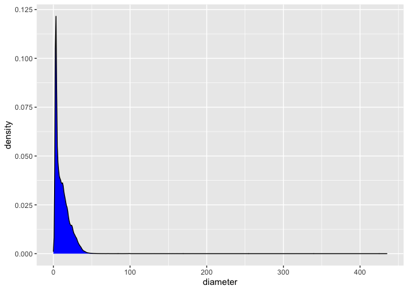
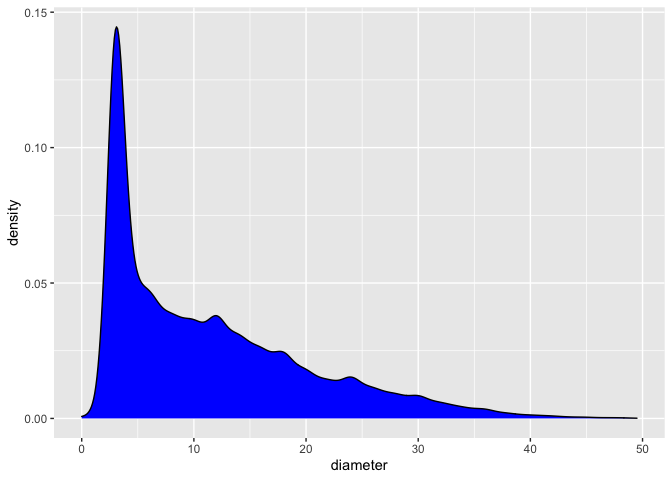
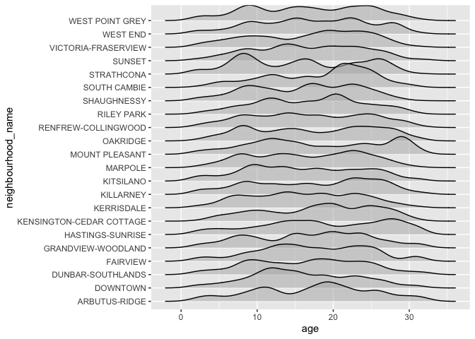

# Preliminaries

First, let’s load the packages we want to work with.

``` r
suppressPackageStartupMessages(library(datateachr))
suppressPackageStartupMessages(library(tidyverse))
```

If you do not have [`datateachr`](https://github.com/UBC-MDS/datateachr)
installed, run the following code in your **R terminal**.

    install.packages("devtools")
    devtools::install_github("UBC-MDS/datateachr")

## Task1.1

Top 4 personal appealing datasets:

1.  cancer_sample
2.  vancouver_trees
3.  building_permits
4.  apt_buildings

## Task1.2

First, to familiarize more with each dataset, we take look at class
type, number of rows, number of columns, variables’ name, and type of
each variable for each dataset. These properties could be obtained by
`class()`, `dim()` and `glimpse()` functions.

### Cancer sample dataset

For this sepcific dataset, it is useful to see decription of variables
availaibe at
[`UCI Machine Learning Breast Cancer Wisconsin`](https://archive.ics.uci.edu/ml/datasets/Breast+Cancer+Wisconsin+%28Diagnostic%29).
The summary is provided below:

**Variables Information**:

1.  ID number
2.  Diagnosis (M = malignant, B = benign)

Ten real-valued features are computed for each cell nucleus:

1.  radius (mean of distances from center to points on the perimeter)
2.  texture (standard deviation of gray-scale values)
3.  perimeter
4.  area
5.  smoothness (local variation in radius lengths)
6.  compactness (perimeter^2 / area - 1.0)
7.  concavity (severity of concave portions of the contour)
8.  concave points (number of concave portions of the contour)
9.  symmetry
10. fractal dimension (“coastline approximation” - 1)

``` r
# class format
class(cancer_sample)
```

    ## [1] "spec_tbl_df" "tbl_df"      "tbl"         "data.frame"

``` r
# dimension of dataset
dim(cancer_sample)
```

    ## [1] 569  32

``` r
# name and type of each variable
glimpse(cancer_sample)
```

    ## Rows: 569
    ## Columns: 32
    ## $ ID                      <dbl> 842302, 842517, 84300903, 84348301, 84358402, …
    ## $ diagnosis               <chr> "M", "M", "M", "M", "M", "M", "M", "M", "M", "…
    ## $ radius_mean             <dbl> 17.990, 20.570, 19.690, 11.420, 20.290, 12.450…
    ## $ texture_mean            <dbl> 10.38, 17.77, 21.25, 20.38, 14.34, 15.70, 19.9…
    ## $ perimeter_mean          <dbl> 122.80, 132.90, 130.00, 77.58, 135.10, 82.57, …
    ## $ area_mean               <dbl> 1001.0, 1326.0, 1203.0, 386.1, 1297.0, 477.1, …
    ## $ smoothness_mean         <dbl> 0.11840, 0.08474, 0.10960, 0.14250, 0.10030, 0…
    ## $ compactness_mean        <dbl> 0.27760, 0.07864, 0.15990, 0.28390, 0.13280, 0…
    ## $ concavity_mean          <dbl> 0.30010, 0.08690, 0.19740, 0.24140, 0.19800, 0…
    ## $ concave_points_mean     <dbl> 0.14710, 0.07017, 0.12790, 0.10520, 0.10430, 0…
    ## $ symmetry_mean           <dbl> 0.2419, 0.1812, 0.2069, 0.2597, 0.1809, 0.2087…
    ## $ fractal_dimension_mean  <dbl> 0.07871, 0.05667, 0.05999, 0.09744, 0.05883, 0…
    ## $ radius_se               <dbl> 1.0950, 0.5435, 0.7456, 0.4956, 0.7572, 0.3345…
    ## $ texture_se              <dbl> 0.9053, 0.7339, 0.7869, 1.1560, 0.7813, 0.8902…
    ## $ perimeter_se            <dbl> 8.589, 3.398, 4.585, 3.445, 5.438, 2.217, 3.18…
    ## $ area_se                 <dbl> 153.40, 74.08, 94.03, 27.23, 94.44, 27.19, 53.…
    ## $ smoothness_se           <dbl> 0.006399, 0.005225, 0.006150, 0.009110, 0.0114…
    ## $ compactness_se          <dbl> 0.049040, 0.013080, 0.040060, 0.074580, 0.0246…
    ## $ concavity_se            <dbl> 0.05373, 0.01860, 0.03832, 0.05661, 0.05688, 0…
    ## $ concave_points_se       <dbl> 0.015870, 0.013400, 0.020580, 0.018670, 0.0188…
    ## $ symmetry_se             <dbl> 0.03003, 0.01389, 0.02250, 0.05963, 0.01756, 0…
    ## $ fractal_dimension_se    <dbl> 0.006193, 0.003532, 0.004571, 0.009208, 0.0051…
    ## $ radius_worst            <dbl> 25.38, 24.99, 23.57, 14.91, 22.54, 15.47, 22.8…
    ## $ texture_worst           <dbl> 17.33, 23.41, 25.53, 26.50, 16.67, 23.75, 27.6…
    ## $ perimeter_worst         <dbl> 184.60, 158.80, 152.50, 98.87, 152.20, 103.40,…
    ## $ area_worst              <dbl> 2019.0, 1956.0, 1709.0, 567.7, 1575.0, 741.6, …
    ## $ smoothness_worst        <dbl> 0.1622, 0.1238, 0.1444, 0.2098, 0.1374, 0.1791…
    ## $ compactness_worst       <dbl> 0.6656, 0.1866, 0.4245, 0.8663, 0.2050, 0.5249…
    ## $ concavity_worst         <dbl> 0.71190, 0.24160, 0.45040, 0.68690, 0.40000, 0…
    ## $ concave_points_worst    <dbl> 0.26540, 0.18600, 0.24300, 0.25750, 0.16250, 0…
    ## $ symmetry_worst          <dbl> 0.4601, 0.2750, 0.3613, 0.6638, 0.2364, 0.3985…
    ## $ fractal_dimension_worst <dbl> 0.11890, 0.08902, 0.08758, 0.17300, 0.07678, 0…

### Vancouver trees dataset

The general information about the dataset that is obtained from
[`Vancouver Open Portal`](https://opendata.vancouver.ca/explore/dataset/street-trees/information/?disjunctive.species_name&disjunctive.common_name&disjunctive.height_range_id&dataChart=eyJxdWVyaWVzIjpbeyJjb25maWciOnsiZGF0YXNldCI6InN0cmVldC10cmVlcyIsIm9wdGlvbnMiOnsiZGlzanVuY3RpdmUuc3BlY2llc19uYW1lIjp0cnVlLCJkaXNqdW5jdGl2ZS5jb21tb25fbmFtZSI6dHJ1ZSwiZGlzanVuY3RpdmUuaGVpZ2h0X3JhbmdlX2lkIjp0cnVlfX0sImNoYXJ0cyI6W3siYWxpZ25Nb250aCI6dHJ1ZSwidHlwZSI6ImxpbmUiLCJmdW5jIjoiQVZHIiwieUF4aXMiOiJoZWlnaHRfcmFuZ2VfaWQiLCJzY2llbnRpZmljRGlzcGxheSI6dHJ1ZSwiY29sb3IiOiIjMDI3OUIxIn1dLCJ4QXhpcyI6ImRhdGVfcGxhbnRlZCIsIm1heHBvaW50cyI6IiIsInRpbWVzY2FsZSI6InllYXIiLCJzb3J0IjoiIn1dLCJkaXNwbGF5TGVnZW5kIjp0cnVlLCJhbGlnbk1vbnRoIjp0cnVlfQ%3D%3D).

The street tree dataset includes a listing of public trees on boulevards
in the City of Vancouver and provides data on tree coordinates, species
and other related characteristics. Park trees and private trees are not
included in the inventory.

**Data currency**

The dataset is updated on a weekly basis. However, tree attributes are
generally not updated on a regular basis and it may be several years
between updates for many of those attributes. Priorities and resources
determine how fast a change in reality is reflected in the data. The
coordinates were primarily provided by the 2016 Tree Inventory project.

**Data accuracy**

Tree attributes are generally not updated on a regular basis and it may
be several years between updates for many of those attributes.

The coordinates and/or addresses are incorrect for these Trees ID:
**21616, 115677, 139140, 209663, 209664, 213592, 255944, 256303**

**Note**: 0 value in latitude and longitude fields mean there is no
related information available.

``` r
# class format
class(vancouver_trees)
```

    ## [1] "tbl_df"     "tbl"        "data.frame"

``` r
# number of rows and columns
dim(vancouver_trees)
```

    ## [1] 146611     20

``` r
# name and type of variables
glimpse(vancouver_trees)
```

    ## Rows: 146,611
    ## Columns: 20
    ## $ tree_id            <dbl> 149556, 149563, 149579, 149590, 149604, 149616, 149…
    ## $ civic_number       <dbl> 494, 450, 4994, 858, 5032, 585, 4909, 4925, 4969, 7…
    ## $ std_street         <chr> "W 58TH AV", "W 58TH AV", "WINDSOR ST", "E 39TH AV"…
    ## $ genus_name         <chr> "ULMUS", "ZELKOVA", "STYRAX", "FRAXINUS", "ACER", "…
    ## $ species_name       <chr> "AMERICANA", "SERRATA", "JAPONICA", "AMERICANA", "C…
    ## $ cultivar_name      <chr> "BRANDON", NA, NA, "AUTUMN APPLAUSE", NA, "CHANTICL…
    ## $ common_name        <chr> "BRANDON ELM", "JAPANESE ZELKOVA", "JAPANESE SNOWBE…
    ## $ assigned           <chr> "N", "N", "N", "Y", "N", "N", "N", "N", "N", "N", "…
    ## $ root_barrier       <chr> "N", "N", "N", "N", "N", "N", "N", "N", "N", "N", "…
    ## $ plant_area         <chr> "N", "N", "4", "4", "4", "B", "6", "6", "3", "3", "…
    ## $ on_street_block    <dbl> 400, 400, 4900, 800, 5000, 500, 4900, 4900, 4900, 7…
    ## $ on_street          <chr> "W 58TH AV", "W 58TH AV", "WINDSOR ST", "E 39TH AV"…
    ## $ neighbourhood_name <chr> "MARPOLE", "MARPOLE", "KENSINGTON-CEDAR COTTAGE", "…
    ## $ street_side_name   <chr> "EVEN", "EVEN", "EVEN", "EVEN", "EVEN", "ODD", "ODD…
    ## $ height_range_id    <dbl> 2, 4, 3, 4, 2, 2, 3, 3, 2, 2, 2, 5, 3, 2, 2, 2, 2, …
    ## $ diameter           <dbl> 10.00, 10.00, 4.00, 18.00, 9.00, 5.00, 15.00, 14.00…
    ## $ curb               <chr> "N", "N", "Y", "Y", "Y", "Y", "Y", "Y", "Y", "Y", "…
    ## $ date_planted       <date> 1999-01-13, 1996-05-31, 1993-11-22, 1996-04-29, 19…
    ## $ longitude          <dbl> -123.1161, -123.1147, -123.0846, -123.0870, -123.08…
    ## $ latitude           <dbl> 49.21776, 49.21776, 49.23938, 49.23469, 49.23894, 4…

### Building permits dataset

The general information about the dataset that is obtained from
[`Vancouver Open Portal`](https://opendata.vancouver.ca/explore/dataset/issued-building-permits/information/).

Building permits are required for new buildings, additions or
alterations to existing buildings, and for demolitions or salvage and
abatement work.

This dataset includes information of all building permits issued by the
City of Vancouver, starting in 2017. The data is based on permit
issuance date and does not show current status of a permit, or changes
after a permit is originally issued.

**Data currency**

The extract for the current year is updated weekly but the extract for
prior year is static.

**Data accuracy**

There may be some loss of quality from data entry errors and omissions,
in particular where the original application date was prior to May 2016
(when permit software changed).

``` r
# class format
class(building_permits)
```

    ## [1] "spec_tbl_df" "tbl_df"      "tbl"         "data.frame"

``` r
# rows and cols
dim(building_permits)
```

    ## [1] 20680    14

``` r
# variables info
glimpse(building_permits)
```

    ## Rows: 20,680
    ## Columns: 14
    ## $ permit_number               <chr> "BP-2016-02248", "BU468090", "DB-2016-0445…
    ## $ issue_date                  <date> 2017-02-01, 2017-02-01, 2017-02-01, 2017-…
    ## $ project_value               <dbl> 0, 0, 35000, 15000, 181178, 0, 15000, 0, 6…
    ## $ type_of_work                <chr> "Salvage and Abatement", "New Building", "…
    ## $ address                     <chr> "4378 W 9TH AVENUE, Vancouver, BC V6R 2C7"…
    ## $ project_description         <chr> NA, NA, NA, NA, NA, NA, NA, NA, NA, NA, NA…
    ## $ building_contractor         <chr> NA, NA, NA, "Mercury Contracting Ltd", "08…
    ## $ building_contractor_address <chr> NA, NA, NA, "88 W PENDER ST  \r\nUnit 2069…
    ## $ applicant                   <chr> "Raffaele & Associates DBA: Raffaele and A…
    ## $ applicant_address           <chr> "2642 East Hastings\r\nVancouver, BC  V5K …
    ## $ property_use                <chr> "Dwelling Uses", "Dwelling Uses", "Dwellin…
    ## $ specific_use_category       <chr> "One-Family Dwelling", "Multiple Dwelling"…
    ## $ year                        <dbl> 2017, 2017, 2017, 2017, 2017, 2017, 2017, …
    ## $ bi_id                       <dbl> 524, 535, 539, 541, 543, 546, 547, 548, 54…

### Apartment buildings

The general information about the dataset that is obtained from
[`Toronto Open Data`](https://opendata.vancouver.ca/explore/dataset/issued-building-permits/information/).

The Apartment Building Standard (ABS) program is based on a new bylaw
Chapter 354, which defines formal criteria to identify all rental
apartment buildings in the city with 3 or more storeys and 10 or more
units. The ABS program is part of RentSafeTO which is a
multi-residential inspection program that establishes standards on how
building owners operate their building(s) and communicate with their
tenants, in addition to establishing a schedule for continuous building
evaluation, audit and enforcement of these standards.

This dataset contains building information for the buildings that are
registered in the ABS program. This information was collected from
building owners/managers during the initial registration process, and is
updated on an annual basis as part of the registration renewal process.

``` r
# format of dataset
class(apt_buildings)
```

    ## [1] "tbl_df"     "tbl"        "data.frame"

``` r
# Number of rows and cols
dim(apt_buildings)
```

    ## [1] 3455   37

``` r
# Variables info like type and name
glimpse(apt_buildings)
```

    ## Rows: 3,455
    ## Columns: 37
    ## $ id                               <dbl> 10359, 10360, 10361, 10362, 10363, 10…
    ## $ air_conditioning                 <chr> "NONE", "NONE", "NONE", "NONE", "NONE…
    ## $ amenities                        <chr> "Outdoor rec facilities", "Outdoor po…
    ## $ balconies                        <chr> "YES", "YES", "YES", "YES", "NO", "NO…
    ## $ barrier_free_accessibilty_entr   <chr> "YES", "NO", "NO", "YES", "NO", "NO",…
    ## $ bike_parking                     <chr> "0 indoor parking spots and 10 outdoo…
    ## $ exterior_fire_escape             <chr> "NO", "NO", "NO", "YES", "NO", NA, "N…
    ## $ fire_alarm                       <chr> "YES", "YES", "YES", "YES", "YES", "Y…
    ## $ garbage_chutes                   <chr> "YES", "YES", "NO", "NO", "NO", "NO",…
    ## $ heating_type                     <chr> "HOT WATER", "HOT WATER", "HOT WATER"…
    ## $ intercom                         <chr> "YES", "YES", "YES", "YES", "YES", "Y…
    ## $ laundry_room                     <chr> "YES", "YES", "YES", "YES", "YES", "Y…
    ## $ locker_or_storage_room           <chr> "NO", "YES", "YES", "YES", "NO", "YES…
    ## $ no_of_elevators                  <dbl> 3, 3, 0, 1, 0, 0, 0, 2, 4, 2, 0, 2, 2…
    ## $ parking_type                     <chr> "Underground Garage , Garage accessib…
    ## $ pets_allowed                     <chr> "YES", "YES", "YES", "YES", "YES", "Y…
    ## $ prop_management_company_name     <chr> NA, "SCHICKEDANZ BROS. PROPERTIES", N…
    ## $ property_type                    <chr> "PRIVATE", "PRIVATE", "PRIVATE", "PRI…
    ## $ rsn                              <dbl> 4154812, 4154815, 4155295, 4155309, 4…
    ## $ separate_gas_meters              <chr> "NO", "NO", "NO", "NO", "NO", "NO", "…
    ## $ separate_hydro_meters            <chr> "YES", "YES", "YES", "YES", "YES", "Y…
    ## $ separate_water_meters            <chr> "NO", "NO", "NO", "NO", "NO", "NO", "…
    ## $ site_address                     <chr> "65  FOREST MANOR RD", "70  CLIPPER R…
    ## $ sprinkler_system                 <chr> "YES", "YES", "NO", "YES", "NO", "NO"…
    ## $ visitor_parking                  <chr> "PAID", "FREE", "UNAVAILABLE", "UNAVA…
    ## $ ward                             <chr> "17", "17", "03", "03", "02", "02", "…
    ## $ window_type                      <chr> "DOUBLE PANE", "DOUBLE PANE", "DOUBLE…
    ## $ year_built                       <dbl> 1967, 1970, 1927, 1959, 1943, 1952, 1…
    ## $ year_registered                  <dbl> 2017, 2017, 2017, 2017, 2017, NA, 201…
    ## $ no_of_storeys                    <dbl> 17, 14, 4, 5, 4, 4, 4, 7, 32, 4, 4, 7…
    ## $ emergency_power                  <chr> "NO", "YES", "NO", "NO", "NO", "NO", …
    ## $ `non-smoking_building`           <chr> "YES", "NO", "YES", "YES", "YES", "NO…
    ## $ no_of_units                      <dbl> 218, 206, 34, 42, 25, 34, 14, 105, 57…
    ## $ no_of_accessible_parking_spaces  <dbl> 8, 10, 20, 42, 12, 0, 5, 1, 1, 6, 12,…
    ## $ facilities_available             <chr> "Recycling bins", "Green Bin / Organi…
    ## $ cooling_room                     <chr> "NO", "NO", "NO", "NO", "NO", "NO", "…
    ## $ no_barrier_free_accessible_units <dbl> 2, 0, 0, 42, 0, NA, 14, 0, 0, 1, 25, …

## Task1.3

The most two interesting datasets for me are cancer_sample and
Vancouver_trees datasets. For the cancer dataset, I am curious about how
different aspects of a cell’s nuclei attribute to cancer and whether
there is any correlation between them. Also, most of its variables are
numeric, which makes it easy to analyze.

I would like to find out the different types of trees overall and in
each neighborhood within this dataset. It has different variables such
as date, numeric, and characters that make it interesting to analyze.
Also, finding the oldest recorded trees in Vancouver was really exciting
to me.

``` r
oldest_tree <- vancouver_trees %>%
  arrange(date_planted) %>%
  filter(date_planted == first(date_planted)) %>%
  select(std_street, neighbourhood_name, date_planted, latitude, longitude)

oldest_tree
```

    ## # A tibble: 2 × 5
    ##   std_street neighbourhood_name date_planted latitude longitude
    ##   <chr>      <chr>              <date>          <dbl>     <dbl>
    ## 1 E 46TH AV  SUNSET             1989-10-27       49.2     -123.
    ## 2 E 46TH AV  SUNSET             1989-10-27       49.2     -123.

## Task1.4

Cancer_sample: What factor makes cancer cells most distinguishable from
normal cells? In other words, if we have to only look at one feature to
see if the cell is cancerous or not, which feature gives us the most
confidence in our prediction?

Vancouver_trees: For each tree species, does the neighborhood the tree
has grown affect the tree’s growth (height or diameter)? What factors
have made a neighborhood best for them?

Based on these question and overall properties of datasets, I would like
to explore Vancouver_trees dataset.

# Task2 (2.1 and 2.2)

1.  What is the density distribution of the diameter of trees in
    Vancouver? Since the diameter is being used to calculate the age of
    a tree, seeing this distribution gives us a rough idea about the
    distribution of age.

``` r
dmtr <- vancouver_trees %>%
  ggplot(aes(diameter)) +
  geom_density(fill='blue')

print(dmtr)
```



``` r
outlier <- vancouver_trees %>%
  filter(diameter > 50) %>%
  nrow()
outlier
```

    ## [1] 153

Since there are only 153 trees (total entries: 146,611) with more than
50.0 diameters (outliers), we filter them out to have a better
understanding of the distribution.

``` r
dmtr_dist <- vancouver_trees %>%
  filter(diameter < 50) %>% # filtering outliers
  ggplot(aes(diameter)) +
  geom_density(fill='blue')

print(dmtr_dist)
```



1.  In the last section, we mentioned the relation between the diameter
    and age of a tree. For this part, let’s calculate the age of trees
    based on the date planted and `Sys.Date()`. [source of year
    extraction](https://stackoverflow.com/questions/37707060/converting-data-frame-column-from-character-to-numeric/37707117).

``` r
van_tree_wAge <- vancouver_trees %>%
  # Extracting year from date format and convert it to numeric value
  mutate(age = as.numeric(format(as.Date(Sys.Date(),format="%Y-%m-%d"),"%Y")) -
           as.numeric(format(as.Date(date_planted,format="%Y-%m-%d"),"%Y"))) %>%
  select(tree_id, date_planted, age, everything())


head(van_tree_wAge)
```

    ## # A tibble: 6 × 21
    ##   tree_id date_planted   age civic_number std_street genus_name species_name
    ##     <dbl> <date>       <dbl>        <dbl> <chr>      <chr>      <chr>       
    ## 1  149556 1999-01-13      22          494 W 58TH AV  ULMUS      AMERICANA   
    ## 2  149563 1996-05-31      25          450 W 58TH AV  ZELKOVA    SERRATA     
    ## 3  149579 1993-11-22      28         4994 WINDSOR ST STYRAX     JAPONICA    
    ## 4  149590 1996-04-29      25          858 E 39TH AV  FRAXINUS   AMERICANA   
    ## 5  149604 1993-12-17      28         5032 WINDSOR ST ACER       CAMPESTRE   
    ## 6  149616 NA              NA          585 W 61ST AV  PYRUS      CALLERYANA  
    ## # … with 14 more variables: cultivar_name <chr>, common_name <chr>,
    ## #   assigned <chr>, root_barrier <chr>, plant_area <chr>,
    ## #   on_street_block <dbl>, on_street <chr>, neighbourhood_name <chr>,
    ## #   street_side_name <chr>, height_range_id <dbl>, diameter <dbl>, curb <chr>,
    ## #   longitude <dbl>, latitude <dbl>

1.  Now that we have the age variable, we can explore the relationship
    between the age of trees and the neighborhood in order to see how
    age is distributed in each area.

``` r
age_nghbr_rel <- van_tree_wAge %>%
  ggplot(aes(age, neighbourhood_name)) +
  ggridges::geom_density_ridges(alpha=0.5)
  
print(age_nghbr_rel)
```

    ## Picking joint bandwidth of 1.35

    ## Warning: Removed 76548 rows containing non-finite values (stat_density_ridges).



1.  For this section, I want to create a tibble with neighbourhood_name,
    the most dominant tree species (based on the count), and its count
    for each neighborhood.

``` r
dmnnt_trees <- vancouver_trees %>%
  group_by(neighbourhood_name) %>%
  count(species_name) %>%
  arrange(desc(n)) %>%
  top_n(1)
```

    ## Selecting by n

``` r
print(dmnnt_trees)
```

    ## # A tibble: 22 × 3
    ## # Groups:   neighbourhood_name [22]
    ##    neighbourhood_name       species_name     n
    ##    <chr>                    <chr>        <int>
    ##  1 VICTORIA-FRASERVIEW      CERASIFERA    1241
    ##  2 KITSILANO                PLATANOIDES   1188
    ##  3 DUNBAR-SOUTHLANDS        PLATANOIDES   1165
    ##  4 SHAUGHNESSY              PLATANOIDES   1139
    ##  5 KERRISDALE               PLATANOIDES   1067
    ##  6 DOWNTOWN                 RUBRUM        1019
    ##  7 KENSINGTON-CEDAR COTTAGE SERRULATA     1002
    ##  8 RENFREW-COLLINGWOOD      SERRULATA      980
    ##  9 HASTINGS-SUNRISE         CERASIFERA     972
    ## 10 MOUNT PLEASANT           SERRULATA      948
    ## # … with 12 more rows

# Task 3

1.  Which types of trees have been planted the most in the past ten
    years in each neighborhood? In other words, is there a trend in
    cultivated tree species in each area?

2.  Is there any kind of relation between the height of trees (with the
    same type) and the neighborhood they have been planted in?

3.  Within each neighborhood, do trees with a curb around them tend to
    have smaller diameters (in terms of growth)?

4.  Could we validate within the dataset that the age of a tree directly
    relates to its diameter? Is it the same rate among all tree species,
    or it differs from one to another?
